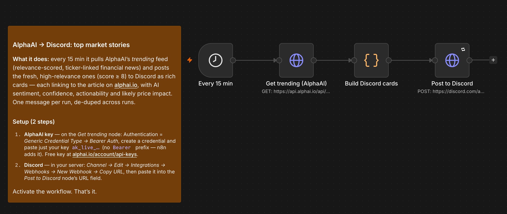
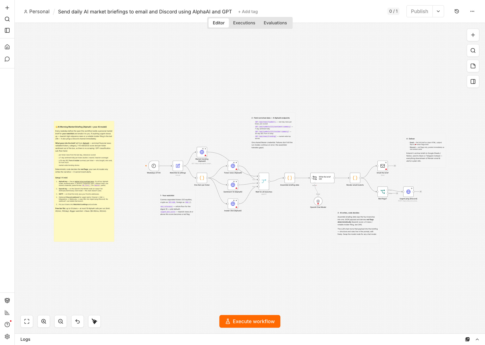
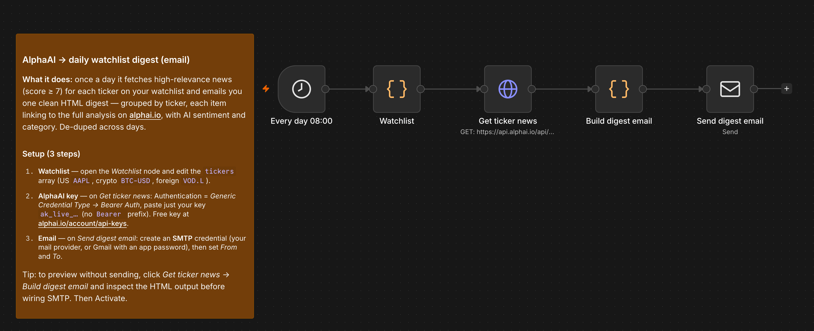
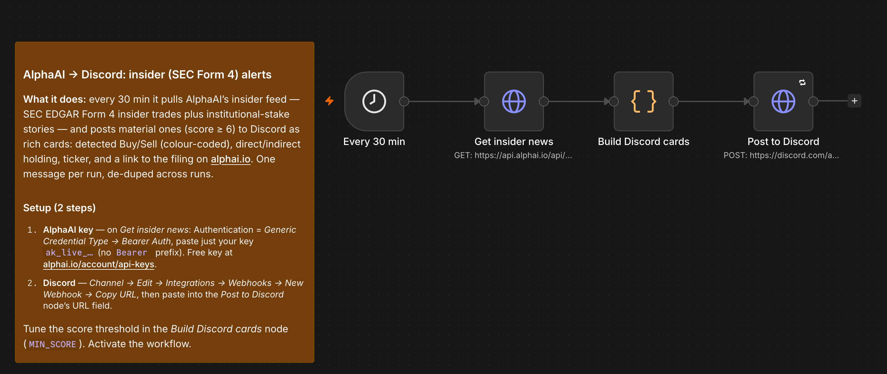

# AlphaAI × n8n templates

Ready-to-import [n8n](https://n8n.io) workflows that turn [AlphaAI](https://alphai.io)'s
relevance-scored, ticker-linked financial news into alerts, digests and automations —
**no code**.

[Website](https://alphai.io) · [API docs](https://alphai.io/developers) · [OpenAPI spec](https://api.alphai.io/api/schema/) · [MCP server](https://alphai.io/mcp)

---

## What is AlphaAI?

AlphaAI is a financial-news **API + MCP server**. Every article is enriched with
per-ticker analysis, a category, an AI **sentiment**, and a **1–10 relevance score** —
so you skip the "fetch raw news, then classify it with an LLM" step. The feed arrives
pre-scored and ticker-linked.

- **Free tier:** 100 calls/day (20/min). Get a key at
  [alphai.io/account/api-keys](https://alphai.io/account/api-keys).
- Higher limits on Basic / Pro — see [pricing](https://alphai.io/pricing).

## Templates

| # | Template | What it does | Delivery |
|---|----------|--------------|----------|
| **04** | [AI morning market briefing](templates/04-ai-morning-market-briefing.json) | Pre-open brief for your watchlist — news, sentiment & insider data, written by your own AI model, with deterministic red-flag alerts | Email + Discord |
| **01** | [Trending news alerts](templates/01-ai-trending-news-to-discord.json) | Fresh top market stories (relevance ≥ 8) as rich cards | Discord |
| **02** | [Watchlist daily digest](templates/02-watchlist-daily-digest-email.json) | One daily email of your tickers' high-relevance news | Email |
| **03** | [Insider (SEC Form 4) alerts](templates/03-insider-form4-to-discord.json) | Material insider buys/sells, colour-coded | Discord |

Every alert links back to the **full analysis on alphai.io**.

## Quick start (2 minutes)

1. Grab a free API key → [alphai.io/account/api-keys](https://alphai.io/account/api-keys).
2. In n8n: **⋮ → Import from File** → pick a JSON from [`templates/`](templates/).
3. On the AlphaAI HTTP node, set **Authentication → Generic Credential Type →
   Bearer Auth**, and paste **just** your key `ak_live_…` (no `Bearer ` prefix — n8n
   adds it). No secret is stored in the workflow itself.
4. Configure the delivery node (Discord webhook URL, or SMTP for email).
5. **Execute Workflow** to test, then **Activate**.

---

## Template details

### 04 — AI morning market briefing → email + Discord (flagship)

`Schedule (weekdays 07:00)` → `Watchlist & settings` → 4 parallel AlphaAI branches
(per-ticker news · 7-day sentiment · 30-day Form 4 insider summary · market trending)
→ `Merge` → `Assemble` → `LLM chain (any chat model)` → `Render` → `Email` + `IF red
flags → Discord`

Every weekday before the open, builds a personal market brief for your watchlist and
emails it as clean HTML. Deterministic code decides the **red flags** (bearish
score ≥ 8 news or a notable insider filing in the last 24h) — the AI model only
writes the narrative, so it cannot invent alerts; urgent flags also ping a Discord
channel immediately, and the email subject flips to 🚩.

**Setup:** Bearer Auth credential (one, shared by the four AlphaAI nodes), an OpenAI
credential on the model node (or swap it for Anthropic/Gemini — the chain doesn't
care), SMTP on the email node, and optionally a Discord webhook. Up to **6 tickers
fits the Free tier** (≤ 19 calls/run).

### 01 — Trending news → Discord

`Schedule (15 min)` → `GET /api/news/trending/` → `Build cards` → `Discord webhook`

Posts fresh, high-relevance stories (score ≥ 8) to a Discord channel as rich embed
cards — one message per run, de-duplicated across runs. Each card shows the ticker(s),
AI **sentiment / confidence / actionability / likely price impact**, colour-coded by
sentiment, with the title linking to the full analysis.

**Setup:** Bearer Auth credential with your key, and a Discord channel webhook URL
(*Channel → Edit → Integrations → Webhooks → New Webhook → Copy URL*).

### 02 — Watchlist daily digest → email

`Schedule (daily)` → `Watchlist` → `GET /api/news/?symbol=…&min_relevance=7` → `Build digest` → `Send Email`

Once a day, fetches the high-relevance news (score ≥ 7) for each ticker on your
watchlist and emails one clean HTML digest, grouped by ticker, each item linking to
the article on alphai.io. De-duplicated across days.

**Setup:** edit the `tickers` array in the *Watchlist* node, add a Bearer Auth
credential, and create an **SMTP** credential on the email node (any provider; Gmail
works with an app password). Tip: run up to *Build digest email* to preview the HTML
before wiring SMTP.

### 03 — Insider (SEC Form 4) alerts → Discord

`Schedule (30 min)` → `GET /api/news/insider/` → `Build cards` → `Discord webhook`

Pushes material insider activity — SEC EDGAR Form 4 trades plus institutional-stake
stories — to Discord as colour-coded cards: detected **Buy/Sell**, **direct/indirect**
holding, ticker, score, and a link to the filing. De-duplicated across runs. Tune the
`MIN_SCORE` threshold in the code node.

**Setup:** Bearer Auth credential and a Discord webhook URL.

---

## Notes

- **No secrets in the JSON.** Your API key lives in an n8n credential, never in the
  workflow file — safe to fork and share.
- **Ticker forms:** US is bare (`AAPL`), crypto is `<SYM>-USD` (`BTC-USD`), foreign
  uses the Yahoo suffix (`VOD.L`, `7203.T`).
- **Relevance score (1–10):** rates the *article's* trading value — 7–8 real company
  news with a fresh catalyst, 9–10 primary/material/newly-disclosed. Defaults filter
  to ≥ 4; the templates raise that where it helps.
- Built on the generic **HTTP Request** node, so they run identically on n8n Cloud and
  self-hosted.

## Screenshots

**Daily watchlist digest (email):**

**Insider (SEC Form 4) alerts (Discord):**

## Links

- Website: https://alphai.io
- Developer docs & score legend: https://alphai.io/developers
- OpenAPI 3.1 spec: https://api.alphai.io/api/schema/
- MCP server (for AI agents): https://alphai.io/mcp
- Changelog: https://alphai.io/changelog

## License

[MIT](LICENSE) — use, fork and adapt freely.
